# 时序图

> PlantUML对于每个图片类型的代码有不一样的格式要求.
> 这些图片都可以被任何PlantUML直接反编译为源代码. 
> > 或者你可以直接查看文章原文的源代码

## 简单示例

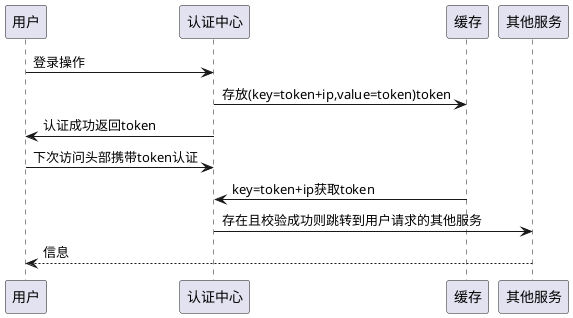

使用 `->` `<-`来绘制箭头  
也可以使用`-->` `<--`来绘制虚线箭头

> 下面的高级内容快速过一遍,不必要强行使用,等需要的时候再来学习即可.

<!--more-->

# 重要高级内容索引

* 声明参与者
* 在参与者中使用非字母符号
* 给自己发消息
* 修改箭头颜色
* 组合消息
* 给消息添加注释
* 生命线的激活与撤销
* 创建参与者
* 包裹参与者


*选修*

* 文字在箭头下方
* 对消息序列编号
* 页眉,页脚,标题
* 跨越所有参与者的备注
* 在同一级对齐多个备注
* 分隔符
* 引用
* 延迟
* 控件(空白范围)
* return语法
* 激活,撤销和创建的快捷语法
* 进入和发出消息
* 缩短的进入与发出
* 锚定和持续时间
* 构造类型和圆圈Icon
* 移除脚注

*没啥用*

* 分割示意图
* 支持Creole和HTML
* 文本换行
* 更多标题和creole
* 外观参数(skinparam)
* 箭头图鉴一部分
* 额外

---

# 声明参与者

使用下面关键字来表明参与者图像  
*原文这里提到了`participant`,如果你不声明,默认就是这个*

* participant(参与者:默认值)
* actor(角色)
* boundary(边界)
* control(控制)
* entity(实体)
* database(数据库)
* collections(集合)
* queue(队列)

*然后可以使用`as`关键字来指定别名*

首先是定义

```plantuml
@startuml 声明参与则-变量定义
'声明变量
participant my as user1 #99FF99
participant you as user2 #red

user1 -> user2
user2 -> user1
@enduml
```
*注意:可以指定颜色*

之前的位置都是由服务器排序的.  
*`order`关键字进行手动排序*
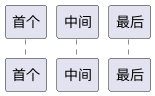

# 在参与者中使用非字母符号

这需要使用`""`夹住内容, 之后使用`as`关键字定义别名  
*可以省略`as`但之后使用也需要`""`包裹,不是很方便*
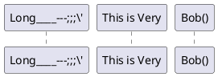

# 给自己发消息

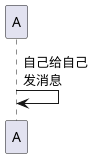

> 可以使用`\n`换行文字

# 文本对齐

## 文字在箭头下方

使用预处理  
`skinparam ResponseMessageBelowArrow true`  
来指定返回方的箭头文字在下方

> 更多内容查看`skinparam`章节

## 修改箭头样式

* `->x`
  * 表示丢失的消息
* 将`<`或`>`替换为`\`或`/`
  * 箭头只有上半或下半
* 使用两次箭头`>>`,`\\`
  * 细箭头
* 用`--`代替`-`
  * 虚线箭头
* `->o`
  * 末尾加圆圈
* `<->`
  * 双向箭头

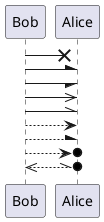

# 修改箭头颜色

*在第一个`-`后面带上颜色`[#red]`或`[#FF00FF]`*

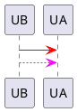

# 对消息序列编号

关键字`autonumber`  
`autonumber [Count = 1] [AddCount = 1] [style = null]`  

中括号中的内容都是可省略的,并表示了省略后的默认值
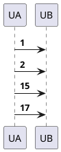

*对于`[style]`项,可以跳过前两项直接指定,内容符合HTML写法*  
注意:`[style]`需要使用`""`包裹
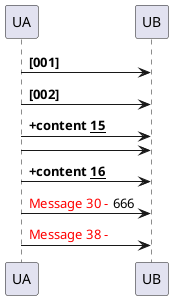

还可以继续使用  
`autonumber stop`  
`autonumber resume [Count = StopTimeCount] [AddCount = PreAddCount] [style = Prestyle]`  
来暂停或继续使用自动编号,继续的时候可以重新指定参数,不指定则默认为上次的后续  

# 页眉,页脚,标题

在通用部分有讲,这里只作演示.

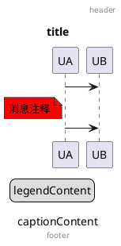

*实际上还有`caption`,`note`和`legend`都能在这里用*

# 分割示意图

关键字`newpage`  
这可能在打印的时候好用

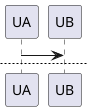

> 预览都显示不出来...看来只有需要打印的长图才能体验下了.

# 组合消息

将消息分组,并给与标签.  
使用以下关键字

* alt/else
* opt
* loop
* par
* break
* critical
* group

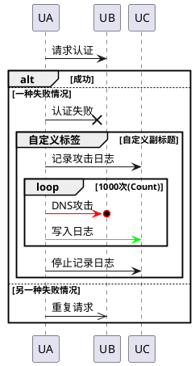

可以看到,这些标签都长得一样,所以区别只是Title,没有特殊功能.

## 次级分组标签

对于`group`而言,可以在标题后方跟`[content]`来编写副标题  
就像上面的例子

# 给消息添加注释

在消息后使用`note`关键字,可以编辑一个注释.  
实际上是绘制一张贴纸,看起来还行.  
上面*标题和页眉页脚*部分有演示.

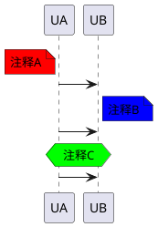

这次注意`over`形式,他表示嵌入到UB,UA中.  
可以看到,注释和箭头是依据同一顺序绘制的.

## 改变注释框形状

* hnote
  * 六边形
* rnote
  * 正方形

它们可以代替`note`关键字, 可以理解为继承于`note`  
上面例子使用了一个`hnoge`,并可以用`end note`结束

# 跨越所有参与者的备注

`note across`

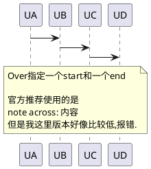

# 在同一级对齐多个备注

关键字`/ note`

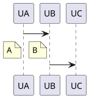
*好像只有紧挨着的才能对齐*  
*如果到下一个箭头下面,则不能违背规则的拉上来对齐*

# 支持Creole和HTML

详见通用  
就是一些文字和横线,主要大头是HTMl

# 分隔符

关键字`== ==`  
可以在中间书写分割Title

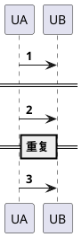

# 引用

关键字`ref over`  
像是`note`和`group`的组合体  

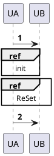

# 延迟

关键字`...`  
还可以书写额外注释

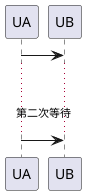

# 文本换行

*预处理*关键字`maxMessageSize`  
文档说不支持中文自动换行,不演示了.  
推荐使用手动换行`\n`

# 控件(空白范围)

关键字`|||`增加控件  
可以使用`||100||`来指定增加多大.

# 生命线的激活与撤销

关键字 `activate` 和 `deactivate` 用于展示生命线

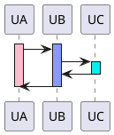
*可以看到,这里也支持颜色*

也可以使用关键字`autoactivate`来自动化生命线  
关闭则需要`return`关键字

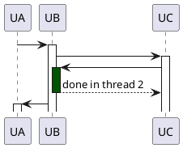
*可见上面有一种新的颜色用法,在此时表示自动生命线的颜色*

# return语法

如上例中的`return`  
它的用处是返回到上一级的生命线中. 后续内容是一个展示用字符串

# 创建参与者

关键字`create`用于在中途创建一个对象  
他比其他自动生成或者手动定义的对象表现得声明周期少一点.

```plantuml
@startuml
UA -> UB
create control UC
'UA -> UB error
UA -> UC
@enduml
```
*使用`create`之后必须创建指定的这个对象,不然报错*  
*`create`的时候任然可以指定参与者类型*

# 激活,撤销和创建的快捷语法

* ++
  * 激活目标
* -- 
  * 撤销激活
* `**`
  * 创建目标实例
* !!
  * 销毁目标实例

```plantuml
@startuml
UA -> UB ++ : P1
UB -> UB ++ #red: P2
UB -> UB --: p3
UB -> UC --** :create
UC -> UD !! : delete
UB -> UC !! : delete
UD -> UA 
@enduml
```
*可见这些符号可以重复使用,包括`--++`*  
删除实际上就是打了个大号`X`

# 进入和发出消息

你可以从最左边和最右边不存在任何参与者的地方发送或接受信息  
关键字`[`和`]`

```plantuml
@startuml
[->UA:进入
UA ->]: 发出
@enduml
```
*相当于是`plantuml`预定义了两个实体,名为`[`和`]`*

# 缩短的进入与发出

使用`?`来代替`[`和`]`  
这样箭头会缩短

# 锚定和持续时间

使用预处理`!pragma teoz true`, 之后通过`{target}`来标记点位  
就可以用`{target1}<->{target2}`来标记中间段

```plantuml
@startuml
!pragma teoz true

{sValue} UA -> UB
||100||
{eContent} UB -> UA
{sValue}<->{eContent}:内容
@enduml
```
*可见标签是可以自定义的*

# 构造类型和圆圈Icon

在声明参与者的时候,可以使用`<<content>>`来为参与者声明一个标题.  
在标题中额外使用`(content,color)`格式,定义一个圆圈Icon  
`content`仅限单字

```plantuml
@startuml
participant UA <<生成UA>>
participant UB << (你,#AADDBB) 生成UB>>
UA -> UB
@enduml
```

有一个预处理`skinparam guillemet false`来开关尖括号样式

# 更多标题和creole

参考通用

# 包裹参与者

可以使用box和end box 添加一个盒子包裹参与者  
还可以添加盒子的颜色或标题

```plantuml
@startuml

box 一个盒子 #red
participant UA
end box
====
UA -> UB
'UB -> UC 开关此行,可能导致第二个格子的内容变化
box 又一个盒子
UC -> UD
end box
@enduml
```
*看到,定义在内容中的盒子实际上是不稳定的*  
*建议在定义参与者的时候同时定义盒子,准确些*

# 移除脚注

关键字`hide footbox`来移除底下那一半参与者

```plantuml
@startuml
hide footbox
UA -> Ub
UB -> UC
@enduml
```

# 外观参数(skinparam)

这是一个大关键字  
用于修改各种外观设置

*文档中例子如下*
```plantuml
@startuml
skinparam SequenceArrowThickness 2
skinparam RoundCorner 20
skinparam MaxMessageSize 60
skinparam SequenceParticipant underline

skinparam BackgroundColor #EDEDCC
skinparam Handwritten true

skinparam sequence{
    ArrowColor DeepSkyBlue
	
	LifeLineStrategy nosolid
    LifeLineBorderColor blue
    LifeLineBackgroundColor #A9DCDF

    ParticipantBorderColor DeepSkyBlue
    ParticipantBackgroundColor DodgerBlue
    ParticipantFontSize 17
    ParticipantFontColor #A9DCDF

    ActorBorderColor DeepSkyBlue
    ActorBackgroundColor aqua
    ActorFontColor DeepSkyBlue
    ActorFontSize 17
    ActorFontName Aapex

	ParticipantPadding 20
    BoxPadding 10

	'styke strictuml '严格UML模式
}
UA -> UB: content1
||100||
UB -> UC: content2
@enduml
```

# 箭头图鉴一部分

```plantuml
@startuml
participant AContent as A
participant BContent as B
A -> 	B: ""-> 	""
A ->> 	B: ""->> 	""
A -\ 	B: ""-\ 	""
A -\\ 	B: ""-\\ 	""
A -/ 	B: ""-/ 	""
A -// 	B: ""-// 	""
A ->x 	B: ""->x 	""
A x-> 	B: ""x-> 	""
A x->x 	B: ""x->x 	""
A ->o 	B: ""->o 	""
A o-> 	B: ""o-> 	""
A o->o 	B: ""o->o 	""
A <-> 	B: ""<-> 	""
A o<->o B: ""o<->o 	""
A x<->x B: ""x<->x 	""
A -\o 	B: ""-\o 	""
A -\\o 	B: ""-\\o 	""
A -/o 	B: ""-/o 	""
A -//o 	B: ""-//o 	""
A x->o 	B: ""x->o 	""
@enduml
```

以上只是一部分

* 可以使用`[`,`]`来表示从外面来和到外面去
* 可以使用`?`代替`[`,`]`来表示*短一些的*从外面来和到外面去

# 额外

关键字`hide unlinked`隐藏未链接的参与者  

# 完毕

**感谢您的观看!**  
本文来自 [ML-Blog][ML-Blog_Link]

<!-- 图片 -->

<!-- 链接 -->

[PlantUML]:https://UserMingHaoLi.github.io/  "PlantUML VSCode插件"

<!-- 水印 -->
[ML-Blog_Link]:https://userminghaoli.github.io/ "我的博客"
