# 简单示例

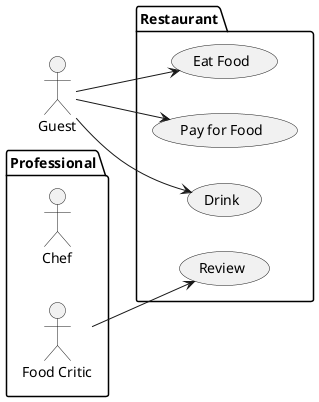

使用`(content)`声明椭圆用例  
也可以使用定义关键字`usecase content`,效果等同

使用`"content"`声明角色  
也可以使用定义关键字`actor content`,效果等同

关键字`package content{...}`来声明一个包,用于分组

使用`-->`来链接用例

> 之后的高级内容快速过一遍,不必要强行使用,等需要的时候再来学习即可.

# 重要高级内容索引

* 声明用例
* 声明角色
* 使用包
* 一个完整的例子

*选修*

* 更改角色样式
* 用例描述
* 连线
* 继承
* 注释(note)
* 改变箭头方向
* 变更线的颜色和样式
* 变更Item颜色和样式

*没啥用*

* 构造类型
* 分割图示
* 从左往右构图
* 显示参数
* 切角的usecase
* 切角的actor

---

# 声明用例

关键字`usecase content`声明椭圆用例  
快速方式则可以使用*圆括号*`(content)`

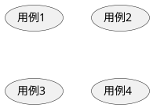

*同样可以使用`as`指定别名*

# 声明角色

关键字`actor content`声明一个角色  
快速方式则可以使用*两个引号*`:content:`  
就是一个小人形状的Item

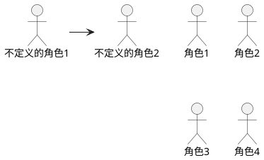
*可见,允许不进行任何声明直接使用,就是角色*

# 更改角色样式

预处理关键字如下  
* skinparam actorStyle awesome
* skinparam actorStyle hellow

## 火柴人(默认)

同`角色`,不演示了

## 用户头像

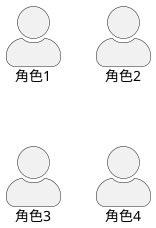

## 透明人

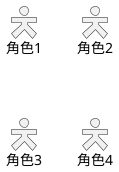

# 用例描述

实际就是在用例中使用`通用`篇章内的语法

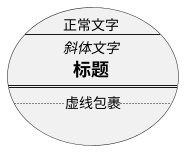

# 使用包

关键字`package content{..}`

同`简单示例`,不演示了

# 连线

使用`->`连线,其中`-`越多线越长

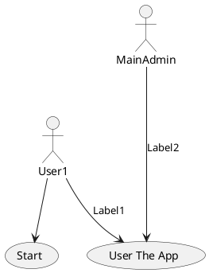

下方有讲两个额外的线
* `.>`表示虚线箭头
* `--`表示无箭头

> 实时上还可以有很多种线,例如`->>`也可以使用

# 继承

使用`<|--`表示继承  
就是绘制一个空心箭头

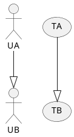

# 注释(note)

就是`通用`介绍过的`note`  

这次的注释可以通过`as`关键字指定别名  
之后可以当作一个Item使用,与其他Item相连  
想要指定别名,就不能使用区块模式,也就不能指定方向.

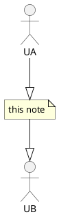

# 构造类型

和`时序图`类似,你可以使用关键字`<<content>>`来定义构造  
也就是多加一行信息到Item

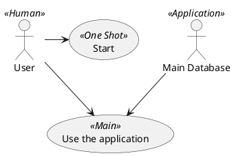
*可见,即使使用了`(content,color)`格式,也没有什么变化*  
*这在用例图中无效,但也不会报错*

# 改变箭头方向

`--`表示竖向  
`-`表示横向

还可以反转箭头来转向

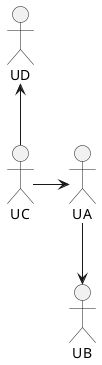

或者给箭头添加方向书写来改变方向  
* -left
* -right
* -up
* -down

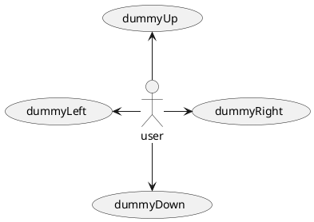

# 分割图示

还是老朋友`newpage`  
还是一如既往的没啥用,不演示了

# 从左往右构图

预处理关键字`top to bottom direction`  
还有`left to right direction`

`简单示例`就是一个变种的例子,不演示了

# 显示参数

一堆预处理参数,都是`skinparam`  
和时序图差不了太多,感兴趣看文档,不演示了.

# 一个完整的例子

和简单示例差不多的感觉...

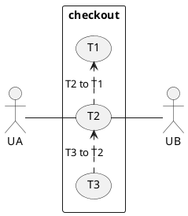

里面有些新东西  
* `.>`表示虚线箭头
* `--`表示无箭头

# 切角的usecase

关键字`usecase/`来替换`usercase`

```plantuml
@startuml
usecase/ UA
@enduml
```

# 切角的actor

关键字`actor/`来替换`actor`

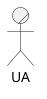

# 变更线的颜色和样式

文档上的提示是  
`#color;line.[bold|dashed|dotted];text:color`  
实际是
`#[color|line:color];line.[bold|dashed|dotted];text:color`

有如下几个关键字  
需要在画线语句之后跟进使用,并用`;`间隔
* `line:color`
* `line.style`
  * `line.bold`
  * `line.dashed`
  * `line.dotted`
* `text:color`

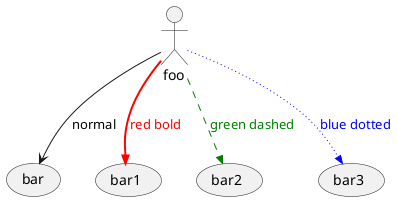

# 变更Item颜色和样式

文档上的提示是  
`#[color|back:color];line:color;line.[bold|dashed|dotted];text:color`  

有如下几个关键字  
* `back:color`
* `line:color`
* `line.style`
  * `line.bold`
  * `line.dashed`
  * `line.dotted`
* `text:color`

```plantuml
@startuml
actor normal
actor "red bold" #back:pink;line:red;line.bold;text:red
usecase "green dashed" #back:palegreen;line:green;line.dashed;text:green
usecase "blue dotted" #back:alicablue;line:blue;line.dotted;text:blue
@enduml
```

# 完毕

**感谢您的观看!**  
本文来自 [ML-Blog][ML-Blog_Link]

<!-- 图片 -->

<!-- 链接 -->

[PlantUML]:https://UserMingHaoLi.github.io/  "PlantUML VSCode插件"

<!-- 水印 -->
[ML-Blog_Link]:https://userminghaoli.github.io/ "我的博客"
