# 简单示例

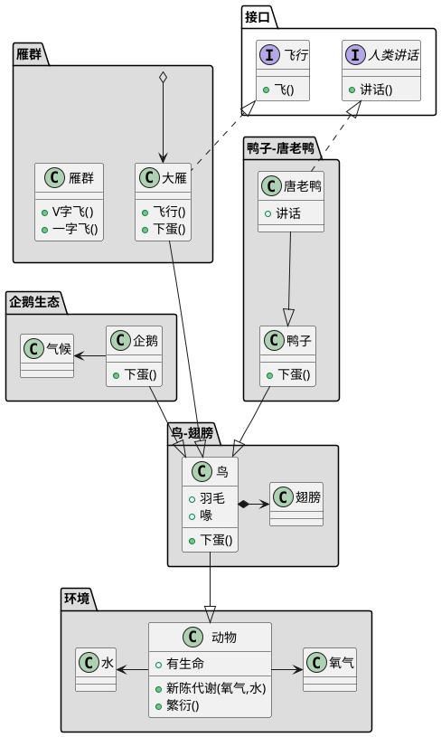
<!--more-->
# 快速学习

声明类可以直接用
```CSharp
+ class MyClass {
+ {static} void Main(String[] arg)
}
interface MyInterface {
  
}
abstract class MyAbstractClass {
  
}
```
*以上内容除了声明类,还使用了icon标记和static标记*

**icon与访问修饰符的关系**
* `-`
  * private
* `#`
  * protected
* `~`
  * package private
* `+`
  * public

**额外访问修饰符**

* `{static}`
* `{abstract}`

## 关系

类和类之间的关系用箭头标记来表示

### 继承

`<|--`

### 实现

`<|..`

### 组合

`*--`

### 聚合

`o--`

### 关联

`-->`

### 依赖

`..>`

# 重要高级内容索引

* 元素声明
* 类之间的关系
* 关系上的标签
* 添加方法
* 定义可访问域
* 抽象类和接口
* 包
* 命名空间(NameSpaces)
* 棒棒糖接口
* 箭头从一个类成员到另一个类成员

*选修*

* 抽象与静态
* 高级类体
* 备注和模板
* 更多注释
* 注释颜色
* 使用非字母字符
* 泛型
* 指定标记
* 包样式
* 改变箭头方向
* 关系类
* 菱形
* 皮肤参数
* 渐变颜色
* 使用关键之指定继承和实现
* 更多线样式
* 更多Item样式

*没啥用*

* 隐藏属性,函数等
* Remove关键字
* 辅助布局
* 拆分大文件

---

# 元素声明

就是不同样式的Item.

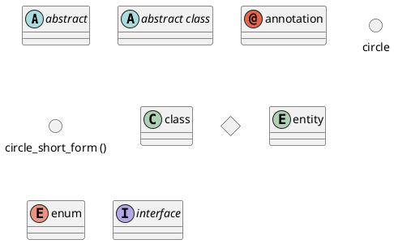

# 类之间的关系

就是箭头,如下.

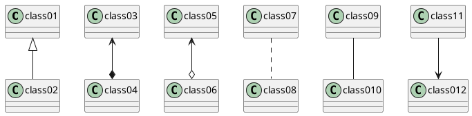
*都可以使用`..`代替`--`来变为虚线*

以下是不常用的

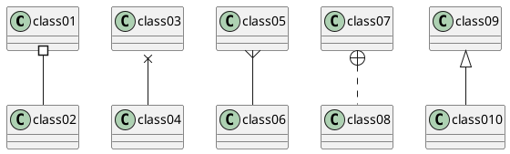

# 关系上的标签

就是在箭头前,箭头后,目标后三个地方书写注释  
对应的就是`pre`,`end`,`center`

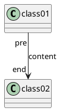

还可以添加`>`或`<`显示一个箭头

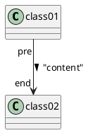
*好像只能在`content`后面追加*

# 添加方法

声明字段或者方法`className : functionName`  

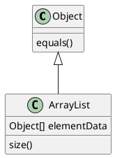

*上面是延时,下面这个才是比较常用的*

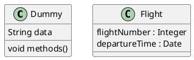
*还可以在声明前使用`{field}`,`{method}`来显示声明字段还是方法*

# 定义可访问域

* `-`
  * private
* `#`
  * protected
* `~`
  * package private
* `+`
  * public

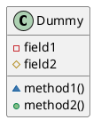

*使用预处理`skinparame classAttributeIconSize 0`*来关闭Icon

# 抽象与静态

提供修饰符关键字`{static}`和`{abstract}`  
用于定义静态或抽象方法属性

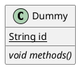
*可以看到,和之前的`{field}`,`{method}`很像*

# 高级类体

使用线来分区  
也可以用于给数据添加左右线  
参阅`通用`

# 备注和模板

老朋友`<<cotent>>`  
和老朋友`note`
*`note`支持四方向和`of`关键字*  
*也支持`as`关键字定义为Item使用*

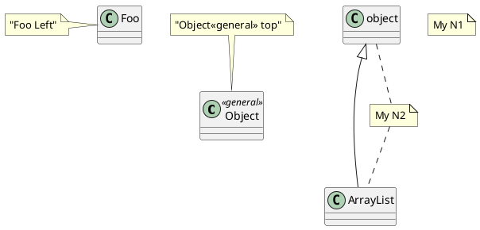
*`note` 可以使用 `note left of className::ChileName`*来指定注释到那个属性或者方法  
其中`chileName`可以使用`""`包裹

# 更多注释

可使用`HTML`标签  
*稍微举例如下*
```
* <b>
* <u>
* <i>
* <s>,<dle>,<strike>
* <font color="#AAAAAA"> or <font color="red">
* <color:#AAAAAA> or <color:red>
* <size:18> to change font size
*  or  the file must be accessible by the filesystem
```

# 注释颜色

`note on link #red`

# 抽象类和接口

上面有介绍的`abstract`或`abstract class`, 还有接口`interface`

# 使用非字母字符

老规矩,使用`""`声明功能多样的String和`as`关键字指定别名

# 隐藏属性,函数等

关键字`hide`和`show`  
基础命令 `hide empty members`,隐藏空白的方法和属性

*更多*

* empty fields
* empty attributes
* empty methods
* fields 
* attributes
* methods
* members
* circle 类名的小圈
* stereotype 原型
* class 所有类
* interface 所有接口
* enum 所有枚举
* <<foo1>> 实现foo1的类
* 任何类的名称
* @unlinked 未连接的单位

*没加 `empty` 前缀的,都会隐藏即使被定义的属性*

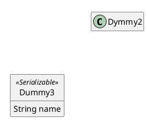
*可见,位置还站着,图的面积没有缩小*

# Remove关键字

`remove className` 可以删除一个类  
和`hide`不一样的是, 他不会留下空白占位符.

也可以使用`@unlinked`关键字

# 泛型

关键字`<content>`

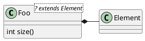

# 指定标记

也就是圆圈,通常他们是由于类型决定的
比如`class`通常是`C`,`interface`通常是`I`

允许使用`*<<(name,color)>>`来修改圆圈  
*注意: `<<content>>也是模板的用法,所以这个实际上是在模板中生效的*  
同`<<(name,color) content>>`, 如果没有`content`你不会看到模板的尖括号.

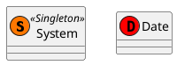

# 包

关键字`package`声明包  
同时指定其颜色和标题

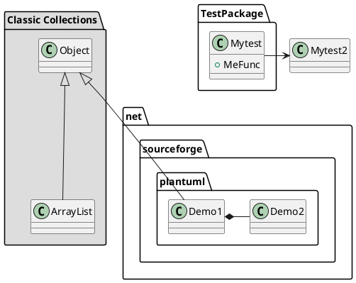
*可见,可以在`package`里声明`class`,如果第一次使用未声明的`class`,默认是在使用的地方声明的*

# 包样式

可以使用预处理关键字`skinparam packageStyle`  
或者使用对应的内置模板

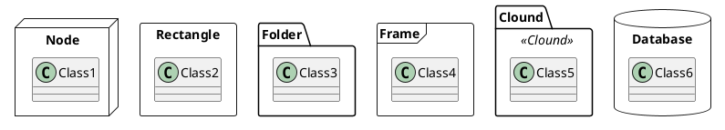
*可见,默认的包样式是`Folder`*

# 命名空间(NameSpaces)

包是一个显示用的定义,实际上包内的类还是在同一个全局命名控件下,所以不同包内的类也不能同名,但是不同命名空间的类可以同名.


*可见`namespace`会展示模板内容到图上,`package`则不会显示*

## 自动命名空间 

可以指定非`.`分割的命名空间,并由类型自己使用  
关键字`set namespaceSeparator ???`

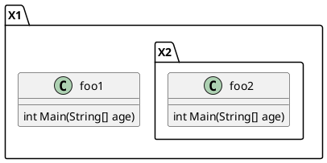
*可见,自动命名空间不会自动嵌套,不是很好用*  
*建议手动*

# 棒棒糖接口

实际就是一个箭头`()--`

还记得棒棒糖元素(Item)吗
```
circle circle
() "circle_short_form ()"
```

这里实际上就是用了简写模式,将`()--`括号朝向的一方定义为`()`.  
也就是棒棒糖Item

```plantuml
@startuml
class Class1 {
  void Main()
}
foo --() bar
foo --() bar1
foo1 --() bar
foo1 --() Class1
@enduml
```
*可见,棒棒糖每次都是重新生成新的,和之前定义的不产生任何关联*

# 改变箭头方向

`--`两个线表示垂直  
`-`一个线表示水平

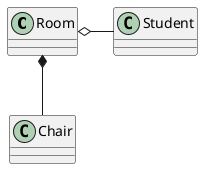
*老规矩,还可以使用四方向关键字来手动指定方向*

```plantuml
@startuml
foo -left-> dummyleft
foo -right-> dummyright
foo -up-> dummytop
foo -down-> dummydown
@enduml
```
*注意: `->`箭头要和`-方向`连在一起*

# 关系类

定义两个类之间的联系后,还可以定义一个关系类  
使用关键字`(PreClassName, EndClassName) .. ClassName`来定义关系类

```plantuml
@startuml
class Student {
  Name
}
class Enrollment {
  drop()
  cancel()
}
Student "0..*" - "1..*" Course
(Student, Course) .. Enrollment
@enduml
```
*可见, 可以先定义类,在通过关键字指定其成为关系类*  
*此处的`.`和`-`都含有方向定义, 所以关系类要放在中间,其箭头一定是垂直的.*

# 菱形

和之前的棒棒糖差不多, 不过这个是非重复的,可以当作类来使用  
*语法回顾*
```
diamond diamond
'<> diamond_short_form'这个我这里编译不出来
```

```plantuml
@startuml
<> diamond
T1 . diamond
diamond - "For 1" T2
diamond - "For 2" T2
@enduml
```

# 皮肤参数

老朋友`skinparam`

这次有新类型

```
BackGroundColor<<Foo>> red
```
*指定应用在某个模板上*

# 渐变颜色

使用`|`,`/`,`\`,`-`来表示渐变

```plantuml
@startuml
skinparam backgroundcolor gold|red
skinparam classBackgroundColor 000000/FFFFFF
class Foo #red\green
class Foo2 #blue-9932CC
class Foo3
@enduml
```
*可见,符号表示渲染的开始和结束方向*

# 辅助布局

关键字`together`会告知引擎尽量将一些类放在一起  
也可以使用隐藏的链接来强制布局

```plantuml
@startuml
class T6
class T2
class T4
together {
 class T1
 class T3
 class T5
}
T3 -[hidden]-> T2
T2 -[hidden]> T4

@enduml
```
*感觉没啥用,不过学到一个关键字`[hidden]`,在`-`后使用*

# 拆分大文件

略

# 扩展阅读

## 使用关键之指定继承和实现

`implements`,`extends`
```plantuml
@startuml
class ArrayList extends AbstractList implements List {
  int size()
}
' class ArrayList implements List
' class ArrayList extends AbstractList
@enduml
```
*两种方式都行,但都只能在声明`class`的时候使用*

## 更多线样式

```plantuml
@startuml
class foo
class bar_normal
class bar_bold
class bar_dashed
class bar_dotted
class bar_hidden
class bar_plain

foo --> bar_normal
foo -[bold,#red]-> bar_bold
foo -[dashed,#FFF000]-> bar_dashed 
foo -[dotted,#green,thickness=8]-> bar_dotted 
foo -[hidden,thickness=4]-> bar_hidden 
foo -[plain,thickness=16]-> bar_plain #blue;line.bold;text:blue : bot
@enduml
```
可见两种形式
* `[(bold|dashed|dotted|hidden|plain),#color,thickness=x]`
* `#color;line.[bold|dashed|dotted];text:color`

## 更多Item样式

模式为
* #[color|back:color];header:color;line:color;line.[bold|dashed|dotted];text:color

```plantuml
@startuml
class class #palegreen-black;header:red/green;line:green;line.dashed;text:blue
interface interface #back:palegreen;header:green;line:blue;line.dashed;text:red
@enduml
```
*当然不能忘了经典的四方向渐变*

## 箭头从一个类成员到另一个类成员

```plantuml
@startuml
class Foo {
  + field1
  + field2
}
class Bar {
  + field3
  + field4
}
Foo::field1 -> Bar::field2
Foo::field2 -> Bar::field3
@enduml
```
*只需以`::`表明成员即可*

# 完毕

**感谢您的观看!**  
本文来自 [ML-Blog][ML-Blog_Link]

<!-- 图片 -->

<!-- 链接 -->

[PlantUML]:https://UserMingHaoLi.github.io/  "PlantUML VSCode插件"

<!-- 水印 -->
[ML-Blog_Link]:https://userminghaoli.github.io/ "我的博客"

