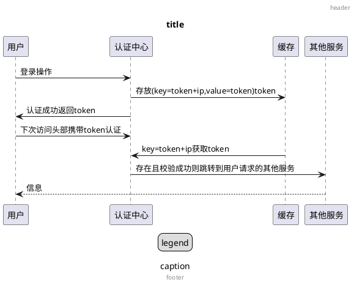

用一个plantuml文档第一页展示的时序图,来展示他的强大功能(的一小部分)



> 本文大部分内容来自`Plant语言参考指引`,并加以本人主观描述.

<!--more-->

# 在VSCode中书写plantuml

只需要导入插件 [PlantUML][PlantUML]

此插件貌似自带一个本地服务,可以直接使用.

> 你可以直接在`.md`文件中使用` ```plantuml `来指定`plantuml`代码块   
> 此时会有高亮提示,并被`PlantUML`插件支持,可以获得导出图片等功能.  

> 而且`Markdown Preview Enhanced`插件的预览功能,可以直接将`.md`文件中的`plantuml`代码段直接在预览中转化为`plantuml图片`的功能(但是GitHub没有此功能)
>> 想要在GitHub中将`plantuml代码`转化为`plantuml图片`则需要请求`plantuml服务器`并设置反向代理,命令`plantuml服务器`请求你指定的`.plantuml`文件
> 具体可以查阅`Markdown Preview Enhanced`和`PlantUML`的相关文档

> 要获取完整提示,必须使用`.plantuml`后缀的文件. 在`.md`文件中写是没有提示的.

# 通用内容

所有设置类信息建议都写在最前面.  
所有关键字不区分大小写,即`scale`和`SCALE`同样的效果.  
同个关键字不要使用多次,会令人疑惑. ~~一般以最后一条为准~~

## 注释

`'` 来表示行注释  
`/' '/`来表示区块注释

## 缩放

使用`scale`关键字设置图片的大小和缩放  
*以下几种情况*
* scale 1.5
* scale 2/3
* scale 200 width
* scale 200 height
* scale 200*100
* scale max 300*200
* scale max 1024 width
* scale max 800 height

可以看到分为三种情况
1. 基于原始倍数的乘数,如`*1.5`,`*2/3`等.
2. 选取一个固定边的大小,如`width = 200`, `height = 200`
   1. 使用`200*100`可以同时声明两种,但是任然只会生效其中能显示最小的一种
3. 还有一种添加`max`的语法,最大只能增幅到原始倍数. 也就是说无论如何都小于等于1倍

## 标题

`title`关键字在图片**顶部**放置一个标题

*还可以使用 `\n` 来换行*

```
title 标题\n标题1
```

*也可以使用HTML格式*

```
title 

<b>标题</b>
<b>标题1</b>

end title
```

可以看出, 通过`title`和`end title`区块,来**原样显示**区域内容.  
且区间内兼容HTML语法.

> 空行也会被原样显示到图片上

## 图片标题

`caption`关键字在图片**底部**放置一个标题

```
caption 

图片标题1
图片标题2

end caption
'caption 图片标题1\n图片标题2
```

同样,支持单句,区块,HTML

## 页眉和页脚

`header`和`footer`分别用于指定页眉和页脚  
还可以额外附加`center`,`left`,`right`这些*位置关键字*修改对齐方式

```
header <b><color red>页眉 默认right</color></b>
footer <b><color red>页脚 默认center</color></b>

left header
页眉 左1
<b><color red>页眉 左2</color></b>
end header
```

同样,支持单句,区块,HTML.  
区块开始使用`left header`,但是结束任然可以只用`end herder`.

> 试过了, 上面的`title`和`caption`不能使用位置关键字

## 图例说明

或者说标签贴纸  
`legend`用于生成图例  
还可以搭配`left`,`center`,`right`

```
legend right
<b><color red>贴纸 默认center</color></b>
end legend
```

> 位置关键字在右边,有点不适应.  而且不能灵活定位,只能在底下  
> 而且只能是区块,单句的在某些版本还会报错

## CSS用法

由于兼容HTML用法,所以可以使用CSS

```HTML
<style>
legend{
	FontSize 30
	BackGroundColor yellow
}
</style>

legend
The legend!!
end legend
```

### 直接设置样式

*以下是一些关键字,使用它们可以代替CSS*  
此处用的是`Title`,可以任意替换为可能的其他组件

```
TitleBackgroundColor
TitleBorderColor
TitleBorderRoundCorner
TitleBorderThickness
TitleFontColor
TitleFontName
TitleFontSize
TitleFontStyle
```

# Creole(样式?)

## 样式文本

```
note left
	is **粗体**
	is //斜体//
	is --删除线--
	is __下划线__
	is ~~wave-underlined~~
end note
```
> 不知道为啥,`~~`对没有生效

## 列表

有序列表`#`  
无序列表`*`

可以混合使用

```
legend
   # 一级有序
   # 一级有序
      # 二级有序
      # 二级有序
   # 一级有序
      * 二级无序
      * 二级无序
   * 一级无序
   # 一级有序
end legend
```

可看出,即使有序中穿插无序,任然会保持计数器

## 横线

横线格式符`-`,`=`,`_`,`.`

连续四个会生成一条线. 使用左右各两个可以夹住中间内容.

```
note right
普通线
----
双重线
====
重线
____
点线
....

--普通线--
==双重线==
__重线__
..点线..
end note
```

可以发现,`重线`的包夹用法和上面的`下划线`用法相似.  
这是因为所有线都需要单独占一行.所以不会产生冲突.  
如果单独一行还不能生成线,则需要和上方再隔开一行.

```
第一__行__
'空行
__第二行__
```

## 标题样式

根据使用的`=`起头数量不同,为不同字号的标题

```
= 一号标题
== 二号标题
=== 三号标题
==== 四号标题
'===== 五号标题
正常文字
```

可以看到五号标题和四号标题相同,所以标题最多四号

## 存粹HTML

你可以直接在PlantUML上写很多HTML标记.

> 太多了,几乎没有限制.

## code区域

或者说原样显示区域,对于此区域的各种格式原样显示.

```
note left
<code>
main()
{
   print("hello world")
}
</code>
end note
```

> 为什么要经常使用`note`区块,因为这些代码都横跨多行,对于大多数的一行语法来说不支持,只能使用各种区块,实际上`legend`也行.

# 表格

```
note left
简单表格
|=|=table|=headerMAXXXXXXX|
|id|table|row|
|id|table|row|
end note
```
差不多就是Markdown语法,但是好像没有对齐选项,而且空格会被填充到表中.

注意表头的`=`,这是标题的语法,上面的标题栏目讲过了,还可不写或者替换为其他的格式符.

## 表格中的颜色

*支持颜色语法如`<#8080FF> 蓝色`, 可以写在行前面表示一整行*
```
|<#FF8080>id|table|row|
<#red>|id|table|row|
```
> 注意`<#red>`前面没有`|`

## 花里胡哨的的表格

*一些新的关键字*
```
<#lightblue,#red> 
<#Navy>           
<color:red>       
<b>               
```

## 无边框表格

请设置表格头行的背景色和线框色都为背景色

```
<#FBFB77,#FBFB77>
```

# 树

```
note left
一棵树Root
|_ 节点1
   |_ 节点1_1
   |_ 节点1_2
|_ 节点2
   |_ 节点2_1
   |_ 节点2_2
|_ 节点3
end note
```

可见,使用关键字`|_`来表示树的节点.  
注意,最上面的`root`节点不需要此标志.  
因为`root`实际是一行无关的文字,删掉也不影响树.

树也可以在任何区块中使用

## 组件树

使用 `component` 关键字定义一个组件树

```
component 用户[
一棵树Root
|_ 节点1
   |_ 节点1_1
   |_ 节点1_2
|_ 节点2
   |_ 节点2_1
   |_ 节点2_2
|_ 节点3
]
```

# 使用Icon

`<&IconName>`

例如`<&heart>`,`<&wifi>`

*具体需要查表*

# 简单语句原样显示

使用两个`"`将语句夹住, 即可原样显示

# 手动渐变图片

```
sprite $fool {
   FFFFFFFFFFFFFFF 
   F0123456789ABCF 
   F0123456789ABCF 
   F0123456789ABCF 
   F0123456789ABCF 
   F0123456789ABCF 
   F0123456789ABCF 
   F0123456789ABCF 
   F0123456789ABCF 
   FFFFFFFFFFFFFFF
}
A -> B:Test<$fool>
```

第一个个`{` 必须同行  
`$`是固定格式  
里面的16进制其实是像素点,越多图片越长.

*可以使用样式缩放*
```
A -> B:Test<$fool{scale=3}> 
```

*更多样式*
```
color=orange
```

> plantuml 提供了命令行工具来导入导出图片.

# 颜色和文字处理

`skinparam`关键字允许你设置颜色,背景,阴影,字体,对齐等.


# 拼写提示

> `PlantUML`这是官方正拼音,从文档里面摘出来的.可以看到有`Plant`和`UML`
> `plantuml`这是插件支持的语法,只有在代码区块指定这个写法,才能渲染颜色.所以出于务实考虑,全篇使用plantuml这一写法

# 预处理

定义需要`!`开头

## 变量定义

必须以`$`开头,并有整形和字符串类型.

在函数外创建的变量作用域是 `global`, 你可以在任何地方访问他们 (包括函数). 当定义变量的时候你可 以使用 `global` 强调这一点.

```
!$ab = "foo1" 
!$cd = "foo2" 
!$ef = $ab + $cd

Alice -> Bob : $ab 
Alice -> Bob : $cd 
Alice -> Bob : $ef 
```

## 条件

支持表达式和`else`语法

```
!$a = 10 
!$ijk = "foo" 
Alice -> Bob : A 
!if ($ijk == "foo") && ($a+10>=40)
Alice -> Bob : yes 
!else 
Alice -> Bob : This should not appear 
!endif 
Alice -> Bob : B
```

## 循环

略,需要再看文档吧

## 空函数

```
!procedure msg($source, $destination)
$source --> $destination
!endprocedure

!procedure init_class($name) 
class $name { 
    toString() 
    hashCode()
}
!endprocedure

!procedure $addCommonMethod()  
    toString() 
    hashCode()
!endprocedure

init_class("foo1") 
init_class("foo2") 
msg("foo1", "foo2") 
```
函数里定义的变量作用域为 local. 意味着随函数一同销毁. 

## 返回函数

不画图,而是返回一个值,方便后续画图.

```
!function $double($a)
!return $a + $a 
!endfunction

Alice -> Bob : The double of 3 is $double(3) 
```

可以简化函数定义为一行: 

```
!function $double($a) return $a + $a
```

变量默认为`local`

> 你可以声明`global`参数的同盟`local`参数,但不建议.

## 参数默认值 

在返回和空函数中, 你可以定义参数默认值. 

```
!function $inc($value, $step=1) 
!return $value + $step 
!endfunction
```

只有在尾端的参数列表才可以定义默认值.,不然就没法使用默认方式调用了.

## 非引号函数

默认情况下, 调用一个函数需要引号. 可以使用 unquoted 关键字指明一个函数的参数不需要使用引号. 

```
!unquoted function id($text1, $text2="FOO") return $text1 + $text2

alice -> bob : id(aa) 
alice -> bob : id(ab,cd) 
```

# 结语

看一遍记不住很正常,不经常用也会忘记,只要记得可以改,再回来找找就行了.

# 完毕

**感谢您的观看!**  
本文来自 [ML-Blog][ML-Blog_Link]

<!-- 图片 -->

<!-- 链接 -->

[PlantUML]:https://UserMingHaoLi.github.io/  "PlantUML VSCode插件"

<!-- 水印 -->
[ML-Blog_Link]:https://userminghaoli.github.io/ "我的博客"
